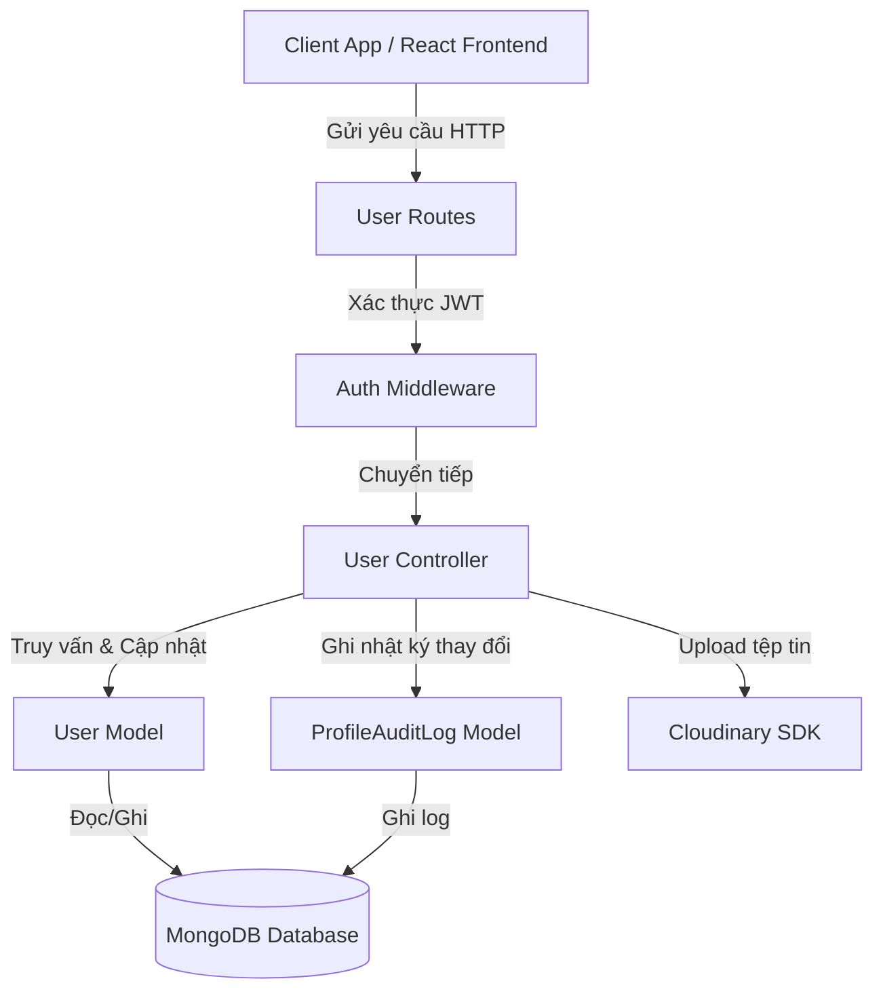

# TÀI LIỆU KIẾN TRÚC VÀ THIẾT KẾ HỆ THỐNG QUẢN LÝ HỒ SƠ NGƯỜI DÙNG (USER PROFILE SYSTEM SPECIFICATION)

Tài liệu này đặc tả chi tiết kiến trúc, thiết kế cơ sở dữ liệu, các giao diện lập trình ứng dụng (API), cơ chế bảo mật, và chiến lược kiểm thử cho hệ thống quản lý hồ sơ người dùng (User Profile System) thuộc nền tảng FitFlow.

---

## 1. TỔNG QUAN HỆ THỐNG (SYSTEM OVERVIEW)

Hệ thống quản lý hồ sơ người dùng chịu trách nhiệm xử lý danh tính, thông tin cá nhân, cài đặt tùy chọn cá nhân, lịch sử bảo mật và tuân thủ dữ liệu (GDPR Compliance) của khách hàng, nhân viên và quản trị viên.

### Mục tiêu thiết kế (Design Goals)
*   **Bảo mật dữ liệu (Data Security):** Mã hóa mật khẩu một chiều bằng thuật toán Bcrypt, kiểm soát truy cập dựa trên vai trò (RBAC) sử dụng JWT.
*   **Nhật ký hoạt động (Audit Logging):** Ghi lại toàn bộ lịch sử truy xuất và sửa đổi dữ liệu nhạy cảm để phát hiện các hoạt động bất thường.
*   **Tùy biến cao (Customization):** Hỗ trợ lưu trữ cài đặt giao diện (theme), ngôn ngữ (locale), và cấu hình thông báo (push/email/sms).
*   **Tuân thủ pháp lý (GDPR Compliance):** Cung cấp API xuất dữ liệu cá nhân (Data Portability) dưới nhiều định dạng tiêu chuẩn (JSON, CSV, XML, HTML).
*   **Chất lượng mã nguồn (Code Quality):** Đảm bảo độ bao phủ kiểm thử đơn vị (Unit Test) > 90% cho các controller, route và model.

---

## 2. KIẾN TRÚC LUỒNG DỮ LIỆU (DATA FLOW ARCHITECTURE)

Hệ thống tuân thủ kiến trúc phân tầng chuẩn (layered architecture):



---

## 3. THIẾT KẾ CƠ SỞ DỮ LIỆU (DATABASE SCHEMA SPECIFICATION)

Hệ thống sử dụng hai Collection chính trong MongoDB: `users` và `profileauditlogs`.

### 3.1. User Model Schema
Lưu trữ thông tin tài khoản, thông tin liên lạc, tùy chọn hiển thị và mức độ hoàn thiện hồ sơ.

```javascript
const userSchema = new mongoose.Schema(
  {
    role: {
      type: String,
      enum: ["owner", "staff", "customer"],
      required: true,
      default: "customer"
    },
    roleLevel: {
      type: Number,
      default: 0
    },
    name: {
      type: String,
      required: true
    },
    phone: {
      type: String,
      required: false,
      default: null
    },
    email: {
      type: String,
      required: true,
      unique: true
    },
    passwordHash: {
      type: String,
      required: true,
      select: false
    },
    authProvider: {
      type: String,
      enum: ["local", "google"],
      default: "local"
    },
    status: {
      type: String,
      enum: ["active", "locked", "pending"],
      default: "active"
    },
    avatarUrl: {
      type: String,
      default: null
    },
    address: {
      type: String,
      default: ""
    },
    gender: {
      type: String,
      enum: ["male", "female", "other", null],
      default: null
    },
    dateOfBirth: {
      type: Date,
      default: null
    },
    preferences: {
      theme: {
        type: String,
        enum: ['light', 'dark', 'system'],
        default: 'light'
      },
      language: {
        type: String,
        enum: ['vi', 'en'],
        default: 'vi'
      },
      notifications: {
        email: { type: Boolean, default: true },
        sms: { type: Boolean, default: false },
        push: { type: Boolean, default: true },
        marketing: { type: Boolean, default: false }
      }
    },
    securitySettings: {
      twoFactorEnabled: {
        type: Boolean,
        default: false
      },
      loginAlertsEnabled: {
        type: Boolean,
        default: true
      },
      passwordLastChanged: {
        type: Date,
        default: Date.now
      },
      failedLoginAttempts: {
        type: Number,
        default: 0
      },
      lockoutUntil: {
        type: Date,
        default: null
      }
    },
    profileCompleteness: {
      type: Number,
      default: 0
    }
  },
  {
    timestamps: true
  }
);
```

### 3.2. ProfileAuditLog Model Schema
Ghi chép các sự kiện thay đổi dữ liệu hồ sơ cá nhân của người dùng.

```javascript
const profileAuditLogSchema = new mongoose.Schema(
  {
    userId: {
      type: mongoose.Schema.Types.ObjectId,
      ref: 'User',
      required: true,
      index: true
    },
    action: {
      type: String,
      required: true,
      enum: [
        'VIEW_PROFILE',
        'UPDATE_PROFILE',
        'CHANGE_PASSWORD',
        'UPLOAD_AVATAR',
        'EXPORT_DATA',
        'UPDATE_PREFERENCES',
        'LOCK_ACCOUNT',
        'UNLOCK_ACCOUNT'
      ]
    },
    ipAddress: { type: String, default: 'unknown' },
    userAgent: { type: String, default: 'unknown' },
    changedFields: { type: [String], default: [] },
    oldValues: { type: mongoose.Schema.Types.Mixed, default: {} },
    newValues: { type: mongoose.Schema.Types.Mixed, default: {} },
    status: {
      type: String,
      enum: ['success', 'failed'],
      default: 'success'
    },
    errorMessage: { type: String, default: null }
  },
  {
    timestamps: true
  }
);
```

---

## 4. CHI TIẾT CÁC GIAO DIỆN LẬP TRÌNH ỨNG DỤNG (API ENDPOINT DETAILS)

Tất cả các API dưới đây yêu cầu Header chứa Token xác thực:
`Authorization: Bearer <JWT_ACCESS_TOKEN>`

### 4.1. Lấy thông tin Profile cá nhân
*   **URL:** `/api/users/me`
*   **Method:** `GET`
*   **Response (200 OK):**
    ```json
    {
      "success": true,
      "message": "Get profile successfully",
      "data": {
        "id": "648a12bc9a9f931d8820abc1",
        "name": "Nguyen Van A",
        "email": "nva@example.com",
        "phone": "0987654321",
        "address": "Ha Noi, Viet Nam",
        "gender": "male",
        "dateOfBirth": "1995-05-15T00:00:00.000Z",
        "avatarUrl": "http://res.cloudinary.com/.../avatar.png",
        "role": "customer",
        "status": "active"
      }
    }
    ```

### 4.2. Cập nhật thông tin Profile cá nhân
*   **URL:** `/api/users/me`
*   **Method:** `PUT`
*   **Payload:**
    ```json
    {
      "name": "Nguyen Van B",
      "phone": "0912345678",
      "address": "TP HCM, Viet Nam",
      "gender": "male",
      "dateOfBirth": "1995-05-20"
    }
    ```
*   **Response (200 OK):**
    ```json
    {
      "success": true,
      "message": "Update profile successfully",
      "data": { ... }
    }
    ```

### 4.3. Đổi mật khẩu cá nhân
*   **URL:** `/api/users/me/change-password`
*   **Method:** `PUT`
*   **Payload:**
    ```json
    {
      "currentPassword": "password123",
      "newPassword": "newSecretPassword456"
    }
    ```
*   **Response (200 OK):**
    ```json
    {
      "success": true,
      "message": "Change password successfully"
    }
    ```

### 4.4. Đổi ảnh đại diện (Upload Avatar)
*   **URL:** `/api/users/me/avatar`
*   **Method:** `PUT`
*   **Content-Type:** `multipart/form-data`
*   **File Field:** `avatar`
*   **Response (200 OK):**
    ```json
    {
      "success": true,
      "message": "Upload avatar successfully",
      "data": {
        "avatarUrl": "https://res.cloudinary.com/fitflow/image/upload/..."
      }
    }
    ```

### 4.5. Lấy tùy chọn hiển thị và thông báo (Preferences)
*   **URL:** `/api/users/me/preferences`
*   **Method:** `GET`
*   **Response (200 OK):**
    ```json
    {
      "success": true,
      "data": {
        "theme": "dark",
        "language": "vi",
        "notifications": {
          "email": true,
          "sms": false,
          "push": true,
          "marketing": false
        }
      }
    }
    ```

### 4.6. Cập nhật tùy chọn hiển thị và thông báo (Preferences)
*   **URL:** `/api/users/me/preferences`
*   **Method:** `PUT`
*   **Payload:**
    ```json
    {
      "theme": "dark",
      "language": "vi",
      "notifications": {
        "email": true,
        "push": false
      }
    }
    ```
*   **Response (200 OK):**
    ```json
    {
      "success": true,
      "message": "Preferences updated successfully",
      "data": { ... }
    }
    ```

### 4.7. Lấy điểm hoàn thiện hồ sơ (Completeness Score)
*   **URL:** `/api/users/me/completeness`
*   **Method:** `GET`
*   **Response (200 OK):**
    ```json
    {
      "success": true,
      "data": {
        "score": 70,
        "missingFields": ["Số điện thoại", "Ảnh đại diện"],
        "isComplete": false
      }
    }
    ```

### 4.8. Lấy lịch sử thay đổi hồ sơ cá nhân (Audit Logs)
*   **URL:** `/api/users/me/activity-logs?page=1&limit=10`
*   **Method:** `GET`
*   **Response (200 OK):**
    ```json
    {
      "success": true,
      "data": {
        "logs": [
          {
            "_id": "649c1234bc5678de90123abc",
            "action": "UPDATE_PROFILE",
            "ipAddress": "192.168.1.1",
            "userAgent": "Mozilla/5.0...",
            "changedFields": ["phone", "address"],
            "status": "success",
            "createdAt": "2026-06-20T10:15:30.000Z"
          }
        ],
        "pagination": {
          "total": 1,
          "page": 1,
          "limit": 10,
          "pages": 1
        }
      }
    }
    ```

### 4.9. Xuất dữ liệu tuân thủ GDPR (GDPR Compliance Export)
Cung cấp khả năng trích xuất toàn bộ lịch sử thông tin và đơn hàng dưới các dạng tệp tải về:
*   **JSON:** `GET /api/users/me/export/json`
*   **CSV:** `GET /api/users/me/export/csv`
*   **XML:** `GET /api/users/me/export/xml`
*   **HTML:** `GET /api/users/me/export/html`

---

## 5. BIỆN PHÁP BẢO MẬT & TUÂN THỦ (SECURITY & COMPLIANCE MECHANISMS)

1.  **Rate Limiting:** Hạn chế số lần gửi yêu cầu đổi mật khẩu và cập nhật thông tin trong một khoảng thời gian ngắn để tránh tấn công brute force hoặc phá hoại dịch vụ.
2.  **Input Validation:** Tất cả các chuỗi đầu vào được tự động cắt khoảng trắng (`trim`), chuẩn hóa định dạng Email và số điện thoại trước khi lưu trữ vào MongoDB.
3.  **Cross-Site Scripting (XSS) Prevention:** Dữ liệu HTML xuất ra được lọc ký tự đặc biệt hoặc mã hóa an toàn.
4.  **Tách biệt mật khẩu:** Trường `passwordHash` được gắn nhãn `select: false` trong Mongoose Schema để hạn chế rò rỉ khi truy vấn thông tin người dùng thông thường.

---

## 6. KIỂM THỬ ĐƠN VỊ (UNIT TESTING PLAN)

Chiến lược kiểm thử sử dụng Framework Jest để mô phỏng (mocking) toàn bộ các dịch vụ ngoài như MongoDB database và dịch vụ Cloudinary để chạy kiểm thử nhanh chóng và độc lập.

### Cấu trúc tệp kiểm thử:
*   `tests/user.controller.test.js` - Chứa bộ 30 test case kiểm thử hoạt động của toàn bộ logic xử lý profile của Controller.
*   `tests/auth.controller.test.js` - Chứa bộ 25 test case kiểm thử quy trình đăng ký, đăng nhập và bảo mật tài khoản.
*   `tests/user.model.test.js` - Kiểm thử cấu trúc, các giá trị mặc định và bộ lọc regex chuẩn hóa dữ liệu đầu vào.

---

*Tài liệu này được phê duyệt bởi Ban Kiến Trúc Phát Triển Dự Án FitFlow.*
